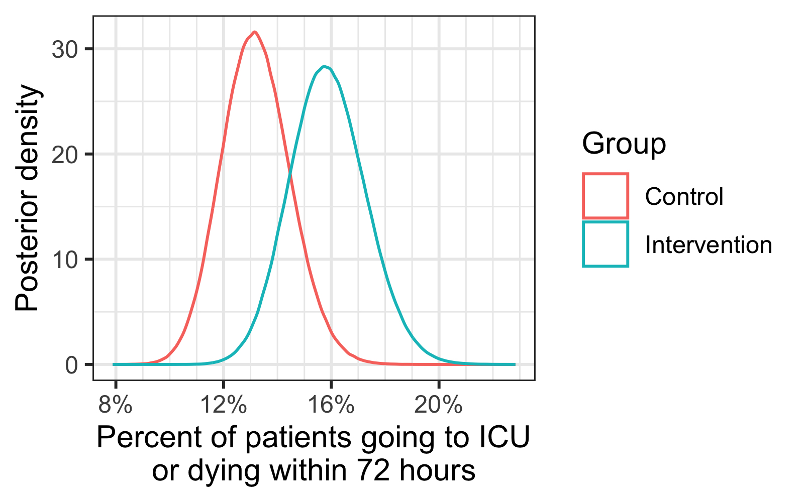

[&#8592;](../research.md) Back to [Research](../research.md) or [Home](../index.md)

### A Bayesian perspective on ICU admission rates

_Note_: these views are my own and are intended as a different perspective on the results of this article. This should not be interpreted as representative of any other authors' views.

The recent article by Leisman et al., [Effect of Automated Real-Time Feedback on Early-Sepsis Care: A Pragmatic Clinical Trial](https://journals.lww.com/ccmjournal/abstract/9900/effect_of_automated_real_time_feedback_on.247.aspx) (of which I am a co-author), studies the effect of paging alerts to care providers for patients suspected of having sepsis. The primary focus is on the effect of such alerts when, at two hours after the provider has acknowledged that sepsis is likely (via a best practice advisory in the medical record), the patient has still not had all relevant 3-hour "bundle" measures completed. In other words, the patients under consideration are those at risk of not having the standard bundle measures completed within three hours of suspected sepsis (and therefore within one hour of the alert). In the intervention/treatment group, a page was generated and sent ($n=670$), while in the control group ($n=707$), no page was sent. The allocation to intervention versus control was done by alternating weeks.

#### ICU rates
As reported in Table 2 (page 217), one of the secondary outcome measures is whether a patient transferred to an ICU or died within 72 hours. This rate was higher in the intervention (paging) group (106/670, or 15.8%) than in the control (no-page) group (93/707, or 13.1%) (difference of 2.7%, 95% CI of $[-1.1,6.4]$; adjusted odds ratio of 1.15, $[0.83,1.58]$). In other words, while the observed rate in the paging group is higher, there is no statistically significant difference (at the 0.05 level).

#### An alternative view
Let us instead consider a Bayesian interpretation of the percent of patients who go to the ICU or die within 72 hours, following the approach of Peter Thall as in [Statistical remedies for medical researchers](https://link.springer.com/book/10.1007/978-3-030-43714-5) (see Section 5.7, "Acute respiratory distress syndrome," pages 91-95 in the first edition). In this case, we are interested in comparing the probabilties of transfer to an ICU or death within 72 hours in the intervention versus control groups, or $\pi_I$ and $\pi_C$, respectively, with $\pi_I = \text{Pr}(\text{outcome} | I)\text{ and }\pi_C = \text{Pr}(\text{outcome}|C).$

Using this, we can estimate $\text{Pr}(\pi_I > \pi_C|\text{data})$, i.e., the probability that the rate is higher in the intervention group than the control given the observed data. Using the [non-informative prior](https://en.wikipedia.org/wiki/Beta_distribution) of $\text{beta}(1/2,1/2)$, this boils down to a comparison of $\text{beta}(106.5,564.5)$ versus $\text{beta}(93.5,614.5)$ (assuming independent observations; there is some discussion of this assumption in the main paper). From sampling using R, an estimate of $\text{Pr}(\pi_I > \pi_C | \text{data}) \approx 0.92$. A visual representation of the two $\text{beta}$ distributions is below:
 

As Thall points out, one useful way to interpret this is by comparing credible intervals with varying coverage. Using the same setup as he does, let us assume that 1000 patients are at risk of not meeting bundle-measure guidelines. Based on this, posterior credible intervals for the number of patients going to ICU or dying within 72 hours are as follows:
<table align="center">
  <tr>
    <th>  Coverage %  </th>
    <th>  Page sent  </th>
    <th>  No page sent  </th>
  </tr>
  <tr>
    <td>80%</td>
    <td>$[141,177]$</td>
    <td>$[116,149]$</td>
  </tr>
    <tr>
    <td>90%</td>
    <td>$[136,182]$</td>
    <td>$[112,154]$</td>
  </tr>
    <tr>
    <td>95%</td>
    <td>$[132,187]$</td>
    <td>$[108,158]$</td>
  </tr>
    <tr>
    <td>99%</td>
    <td>$[124,197]$</td>
    <td>$[101,167]$</td>
  </tr>
</table>

_All of this to say_: understanding if such paging alerts increase likelihood of admission to the ICU requires further study.
